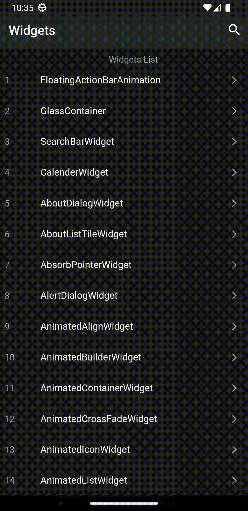

# widgetssamples

A Flutter project demondstrating flutter widgets.

### Some Screenshots

  

# Widget list

Current Widget count `38`

1: [FloatingActionBarAnimation ](lib/widgets/floatingactionbar.dart)

2: [CustomScrollView](lib/widgets/customscrollview.dart)

3: [SearchBar](lib/widgets/searchbar.dart)

4: [Calender](lib/widgets/calender.dart)

5: [AboutDialog](lib/widgets/aboutdialog.dart)

6: [AboutListTile](lib/widgets/aboutlisttile.dart)

7: [AbsorbPointer](lib/widgets/absorbpointer.dart)

8: [AlertDialog](lib/widgets/alertdialog.dart)

9: [AnimatedAlign](lib/widgets/animatedalign.dart)

10: [AnimatedBuilder](lib/widgets/animatedbuilder.dart)

11: [AnimatedContainer](lib/widgets/animatedcontainer.dart)

12: [AnimatedCrossFade](lib/widgets/animatedcrossfade.dart)

13: [AnimatedIcon](lib/widgets/animatedicon.dart)

14: [AnimatedList](lib/widgets/animatedlist.dart)

15: [AnimatedModalBarrier](lib/widgets/animatedmodalbarrier.dart)

16: [AnimatedOpacity](lib/widgets/animatedopacity.dart)

17: [AnimatedPadding](lib/widgets/animatedpadding.dart)

18: [AnimatedPhysicalModel](lib/widgets/animatedphysicalmodel.dart)

19: [AnimatedPosition](lib/widgets/animatedposition.dart)

20: [AnimatedRotation](lib/widgets/animatedrotation.dart)

21: [AnimatedSize](lib/widgets/animatedsize.dart)

22: [AnimatedSwitcher](lib/widgets/animateswitcher.dart)

23: [AppBar](lib/widgets/appbar.dart)

24: [AspectRatio](lib/widgets/aspectratio.dart)

25: [AutoComplete](lib/widgets/autocomplete.dart)

26: [BackdropFilter](lib/widgets/backdropfilter.dart)

27: [Banner](lib/widgets/banner.dart)

28: [Baseline](lib/widgets/baseline.dart)

29: [BottomNavigationBar](lib/widgets/bottomnavigationbar.dart)

30: [ModelBottomSheet](lib/widgets/modelbottomsheet.dart)

31: [Builder](lib/widgets/builder.dart)

32: [Card](lib/widgets/card.dart)

33: [CheckBoxListTile](lib/widgets/checkboxlisttile.dart)

34: [Chip](lib/widgets/chip.dart)

35: [CupertinoContextMenu](lib/widgets/cupertinocontextmenu.dart)

36: [CupertinoPicker](lib/widgets/cupertinopicker.dart)

37: [CustomPaint](lib/widgets/custompaint.dart)

38: [GlassContainer](lib/widgets//glasseffect.dart)

# Pull Requests

I welcome and encourage all pull requests. Here are some basic rules to follow to ensure timely addition of your request:

1.  Match the document style as closely as possible.
2.  Please keep PR titles easy to read and descriptive of changes, this will make them easier to merge.
3.  Pull requests _must_ be made against `main` branch for this particular repository.
4.  Check for existing [issues](https://github.com/Ashwin-Chhetri/FlutterWidgetsSnippets/issues) first, before filing an issue.
5.  Make sure you follow the set standard as all other projects in this repo do

# Created & Maintained By

[Ashwin Chhetri ](https://github.com/Ashwin-Chhetri) 
    
([Linkedin](https://www.linkedin.com/in/ashwin-chhetri/))

